# 架构图和流程图模板

本文档提供各类Mermaid图表模板，用于生成项目架构图和流程图。

## Mermaid 语法速查

### 基本语法
```
graph TB    # 从上到下
graph LR    # 从左到右
graph BT    # 从下到上
graph RL    # 从右到左
```

### 节点形状
```
A[矩形]
B(圆角矩形)
C((圆形))
D{菱形}
E[(数据库)]
F[[子程序]]
```

### 连接线
```
A --> B     # 实线箭头
A --- B     # 实线无箭头
A -.-> B    # 虚线箭头
A ==> B     # 粗线箭头
A --文字--> B  # 带文字的连接
```

---

## 一、系统架构图模板

### 1.1 分层架构图

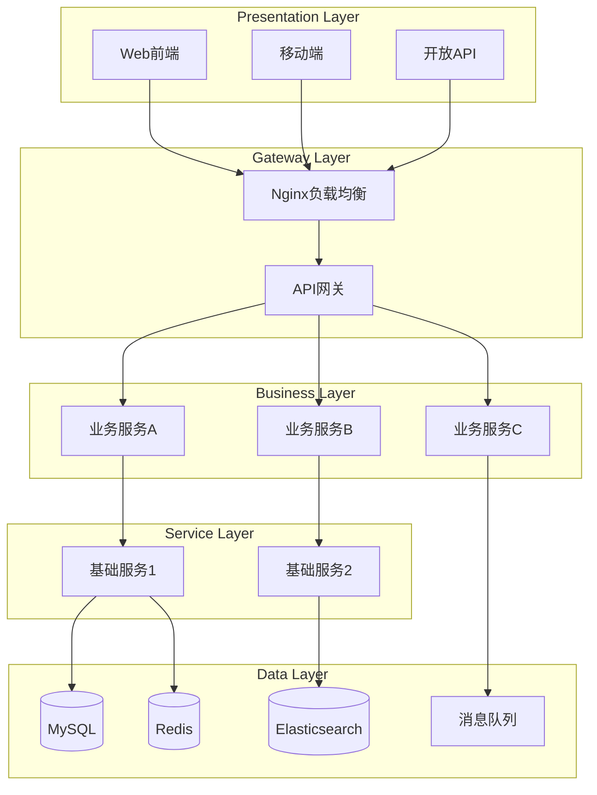

### 1.2 微服务架构图

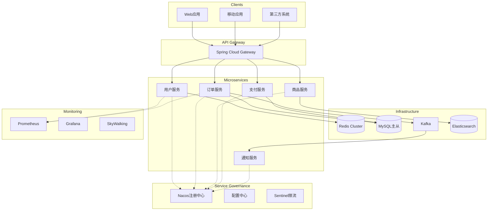

### 1.3 DDD架构图

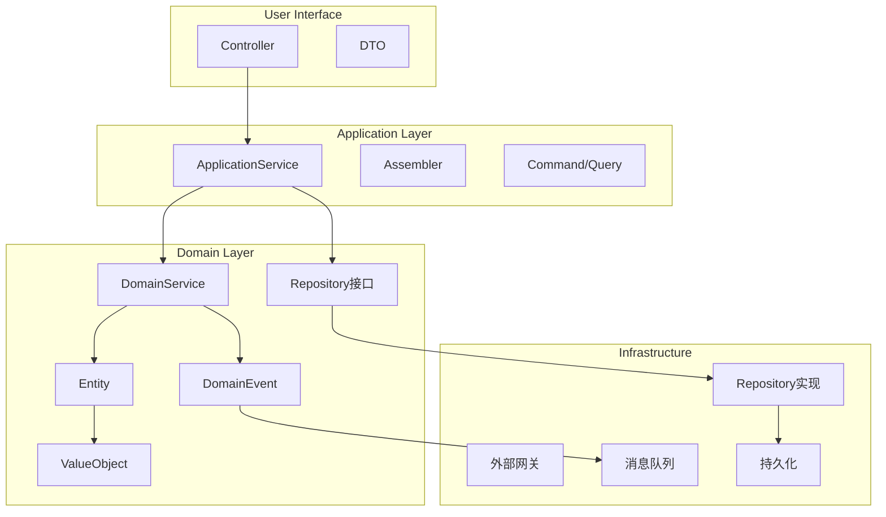

### 1.4 事件驱动架构图

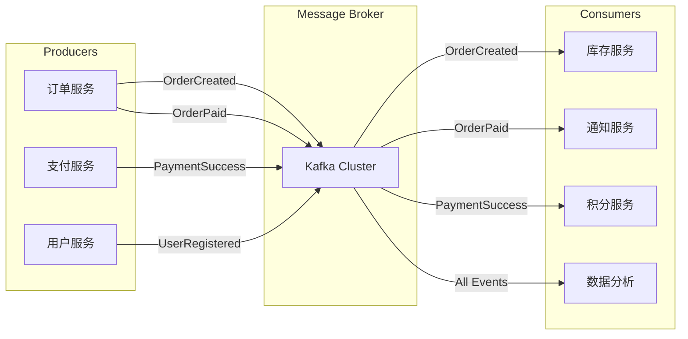

---

## 二、部署架构图模板

### 2.1 Kubernetes部署架构

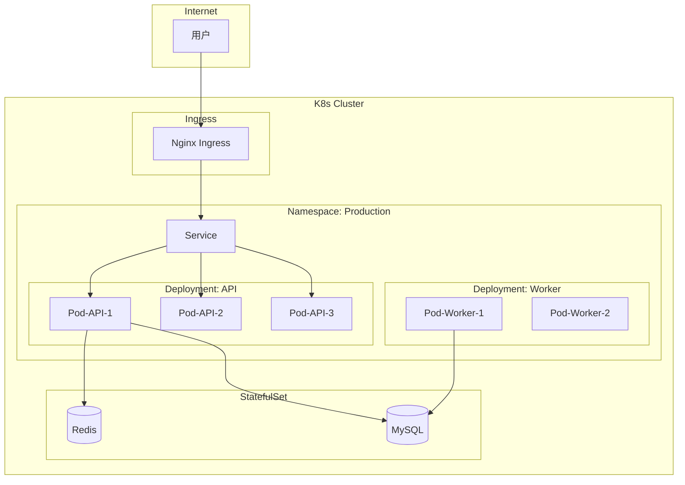

### 2.2 多活部署架构

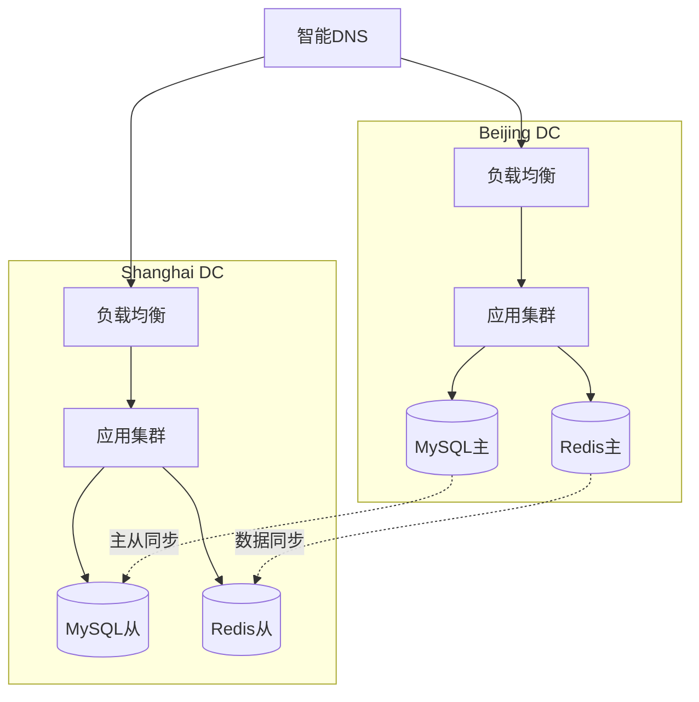

---

## 三、业务流程图模板

### 3.1 下单流程图

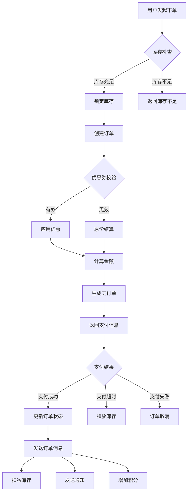

### 3.2 分布式事务流程图

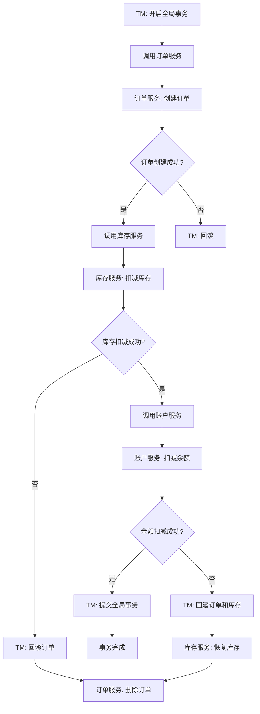

---

## 四、时序图模板

### 4.1 用户登录时序图

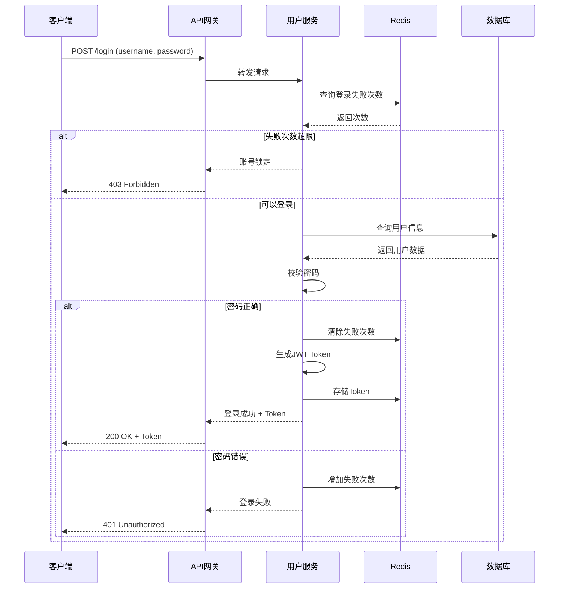

### 4.2 订单支付时序图

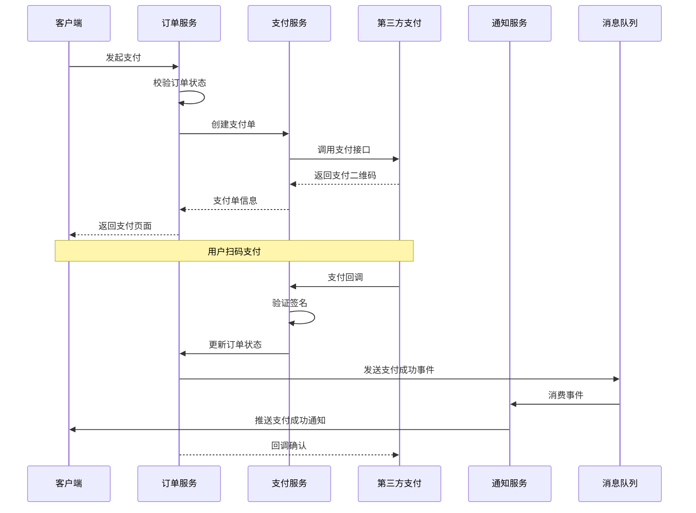

### 4.3 分布式锁时序图

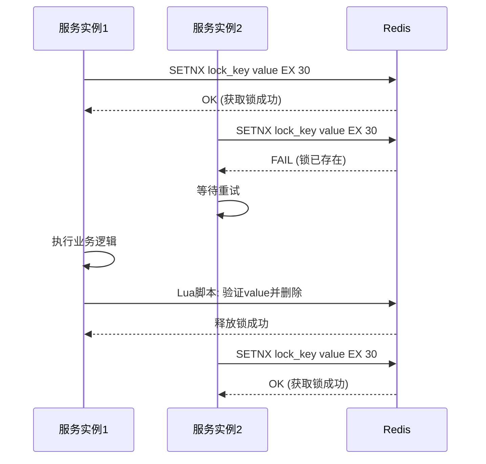

---

## 五、数据流图模板

### 5.1 数据同步流图

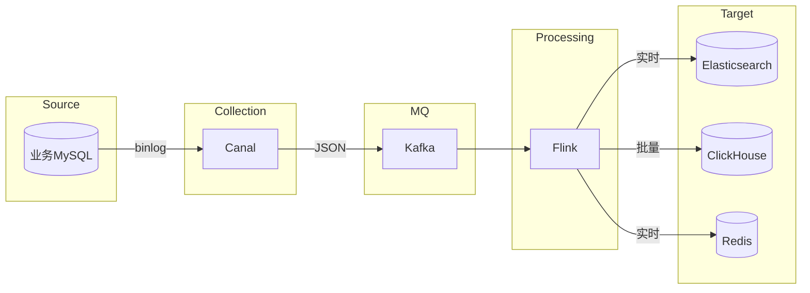

### 5.2 缓存数据流图

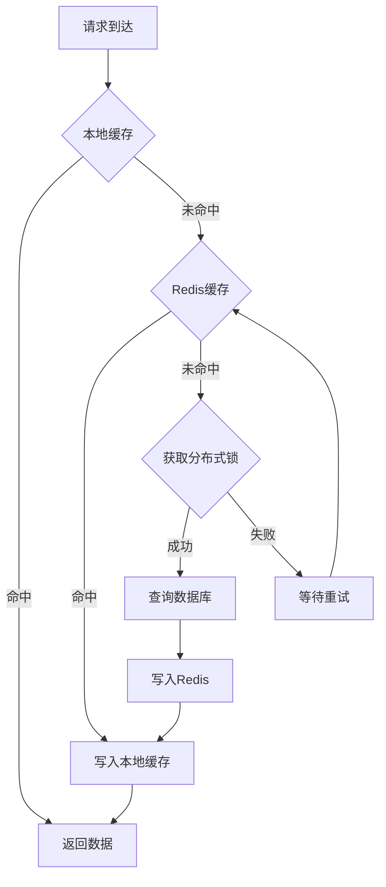

---

## 六、状态图模板

### 6.1 订单状态机

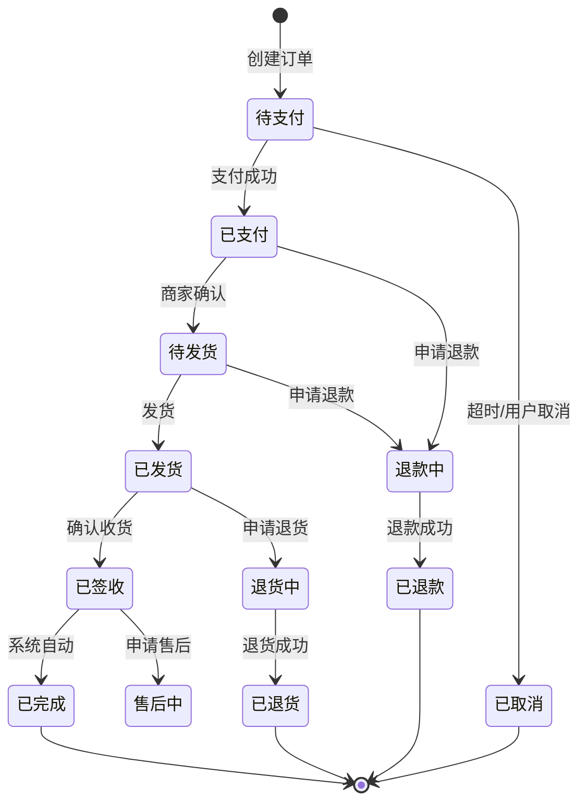

---

## 使用指南

### 根据项目类型选择模板

| 项目类型 | 推荐架构图 | 推荐流程图 |
|---------|-----------|-----------|
| 单体应用 | 分层架构图 | 业务流程图 |
| 微服务 | 微服务架构图 | 时序图 |
| DDD项目 | DDD架构图 | 领域事件流 |
| 大数据 | 数据流图 | 数据管道图 |
| 电商系统 | 微服务+状态机 | 订单流程+支付时序 |

### 图表生成步骤

1. **识别核心组件**: 列出系统的主要服务、数据存储、中间件
2. **确定组件关系**: 标注组件间的调用、依赖、数据流向
3. **分组分层**: 按功能或层次对组件进行分组
4. **选择模板**: 根据项目类型选择合适的模板
5. **定制修改**: 替换模板中的组件名称和关系
