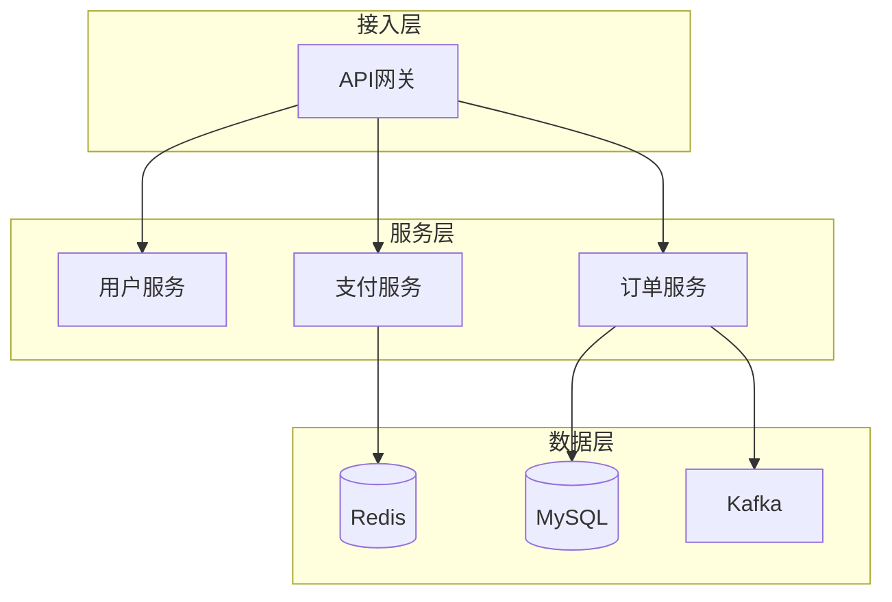

# Project Highlights Skill

一个用于 Claude Code 的技能插件，能够深度分析项目代码库，识别技术亮点和难点，生成架构图和流程图，并输出资深程序员级别的简历项目描述。

<p align="left">
  <a href="./LICENSE"></a>
  <a href="https://code.claude.com/docs/en/plugins"></a>
  <a href="https://github.com/CloudAscendTeam/project-highlights-skill"></a>
</p>

## 功能特性

- **大型项目分析** - 支持复杂项目结构的深度分析（微服务、Mono-repo等）
- **架构图生成** - 使用 Mermaid 自动生成系统架构图
- **流程图生成** - 绘制核心业务流程图和时序图
- **高频技术亮点识别** - 专项分析 9 大技术领域：
  - 高并发（线程池、消息队列、限流降级）
  - 高可用（熔断、降级、容灾）
  - 可扩展（插件化、策略模式）
  - 分布式架构（分布式锁、分布式事务）
  - 微服务治理（服务发现、链路追踪）
  - 性能调优（缓存、SQL优化）
  - 数据库设计（分库分表、读写分离）
  - 锁机制（乐观锁、悲观锁、分布式锁）
  - 事务管理（本地事务、分布式事务）
- **简历输出** - 生成资深程序员级别的项目描述，包含量化成果
- **自动保存报告** - 分析完成后自动将报告保存到项目根目录的 `project-highlights.md` 文件


## 使用方法

### 1. 作为 Claude Code Skill 使用

将 `project-highlights-skill/` 目录作为 Claude Code 的技能引入后，可以通过以下方式触发：

- 请求"分析项目亮点"
- 请求"总结项目经验"
- 请求"生成简历项目描述"
- 请求"画架构图"

### 2. 使用分析脚本

```bash
# 分析当前目录的项目
python project-highlights-skill/scripts/analyze_project.py --path .

# 分析指定项目并输出到文件
python project-highlights-skill/scripts/analyze_project.py --path /path/to/project --output report.json --pretty
```

## 工作流程

```
┌─────────────────────────────────────────────────────────────┐
│                    项目亮点识别流程                           │
├─────────────────────────────────────────────────────────────┤
│  1. 初始扫描 - 识别项目类型、技术栈、目录结构                    │
│  2. 架构分析 - 识别架构模式，生成系统架构图                      │
│  3. 亮点识别 - 9大技术领域深度分析                              │
│  4. 流程图生成 - 核心业务流程、时序图                           │
│  5. 简历输出 - 资深程序员级别项目描述                           │
│  6. 保存报告 - 输出到项目根目录 project-highlights.md          │
└─────────────────────────────────────────────────────────────┘
```

## 输出示例

### 架构图



### 简历项目描述

```
【项目名称】xxx电商平台

项目概述：
基于Spring Cloud微服务架构的B2C电商平台，支持千万级用户，日均订单50万+。

技术栈：
- 后端：Spring Cloud、Spring Boot、MyBatis-Plus
- 中间件：Redis Cluster、Kafka、Elasticsearch
- 数据库：MySQL(分库分表)
- 部署：Kubernetes、Docker

核心职责：
1. 主导订单系统微服务重构，系统吞吐量提升300%
2. 设计分布式库存扣减方案，支持10000 QPS秒杀
3. 优化支付核心链路，成功率达99.99%

技术亮点：
- 【高并发】设计三级缓存架构，热点数据QPS达50000+
- 【高可用】实现服务熔断降级，系统可用性达99.95%
- 【分布式事务】采用Seata AT模式，保证数据一致性
```

## 参考文档

- `project-highlights-skill/references/tech-highlights.md` - 详细的技术亮点识别方法和面试话术
- `project-highlights-skill/references/diagram-templates.md` - 各类 Mermaid 图表模板
- `project-highlights-skill/references/analysis-patterns.md` - 项目分析策略和复杂度评估
- `project-highlights-skill/references/resume-templates.md` - 简历 STAR 表达法和量化指南
